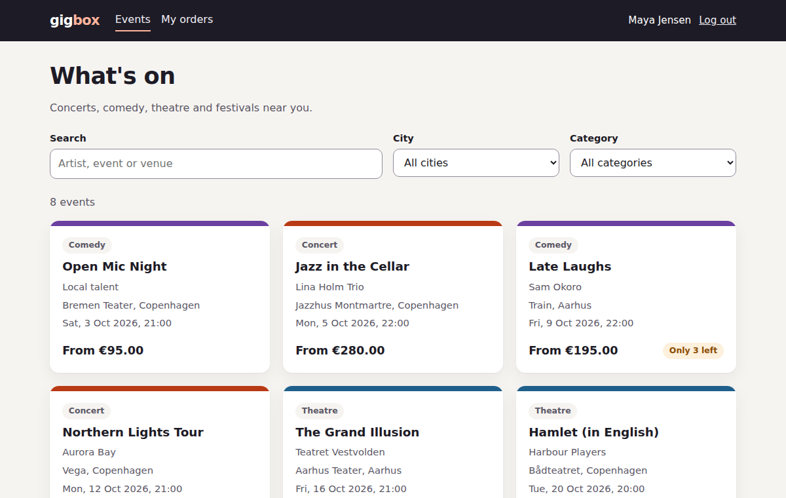
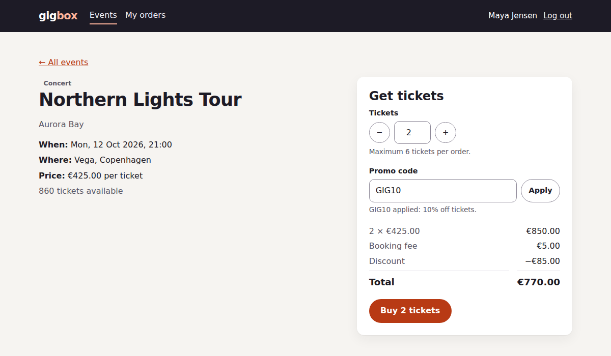

# Gigbox end-to-end tests

[](https://github.com/saylikendole/gigbox-e2e/actions/workflows/e2e.yml)


A Playwright + TypeScript test suite for **Gigbox**, a small concert and event ticketing web app. The app lives in this repo, so the tests run against something real that I control, and CI never breaks because someone else's demo site is down.

**[Latest test report →](https://saylikendole.github.io/gigbox-e2e/)** (published from CI on every push to `main`)



## What's in it

- **57 tests** across 7 spec files on Chromium, with the 7 `@smoke` tests also running on Firefox and a Pixel 7 viewport
- **Page Object Model** with fixtures, so tests read like user stories
- **Log in once** through the real form in a setup project, and reuse the session
- **Per-test data** created through test-only endpoints, so tests run in parallel without touching each other's stock or orders
- **Network mocking** for failures that are hard to trigger for real: server errors, slow responses, dropped connections mid-payment
- **Accessibility:** axe-core scans against WCAG 2.1 AA, plus a keyboard-only purchase and dialog focus checks
- **API rule checks** that confirm the server enforces what the UI shows, which is how [BUG-001](docs/bugs/BUG-001-ticket-limit-not-enforced.md) was found (now fixed)
- **CI** with two parallel shards, merged into one HTML report published to GitHub Pages

## Quick start

Requires Node 20+.

```bash
npm install
npx playwright install chromium firefox
npm test            # starts the app automatically and runs everything
npm run report      # opens the HTML report
```

Other ways to run it:

```bash
npm run test:smoke      # critical paths, all three browsers
npm run test:a11y       # accessibility only
npm run test:ui         # Playwright UI mode, good for exploring
npm run test:headed     # watch it run in Chromium

npm run start:test      # just start the app at http://localhost:3000
```

Demo login: `maya@gigbox.test` / `Gigbox#2026`

## What's tested

| Area | Examples | Spec |
| --- | --- | --- |
| Login | Redirect back after login, wrong password, empty form never hits the API, open-redirect protection, logout kills the session | `login.spec.ts` |
| Browsing | Search by artist or venue, combined city and category filters, sold-out and low-stock badges, date order, empty state | `events.spec.ts` |
| Buying | Happy path to confirmation, price summary for 1-6 tickets, quantity limits, promo codes (valid, unknown, expired), sold out, "someone else bought the last tickets" | `purchase.spec.ts` |
| Orders | Cancel with refund and restock, the 48-hour rule at 47 and 49 hours, users only see their own orders | `orders.spec.ts` |
| Resilience | 500 with retry, loading state, empty catalogue, connection drop during payment, HTML in data never executes (XSS) | `resilience.spec.ts` |
| Accessibility | WCAG 2.1 AA on every page and the cancel dialog, keyboard-only purchase, focus and Escape in the dialog | `accessibility.spec.ts` |
| API rules | Ticket limit at 6/7/50 (BUG-001), client can't set its own price, expired promo, other users' orders, overselling | `api-rules.spec.ts` |

Why these areas and not others: [docs/TEST-STRATEGY.md](docs/TEST-STRATEGY.md).

## The bug this suite found, and the fix

The event page won't let you pick more than 6 tickets. The `+` button disables and typed numbers get corrected. Every UI test for that passed.

The API didn't check the limit at all. One request from the browser console bought 50 tickets. On a ticketing site that's the scalping hole bots use to empty a show.

No UI test could find this, because the UI worked. The API-level tests in `api-rules.spec.ts` did. The fix adds the same limit to `POST /api/orders`, using the same constant the UI reads. Boundary tests at 6, 7 and 50 tickets now guard it. Before trusting them, I ran them against the old code and confirmed they failed. Full write-up: [BUG-001](docs/bugs/BUG-001-ticket-limit-not-enforced.md).

Writing the suite also turned up a smaller defect in the app: the "tickets just sold" message had nowhere to render on the sold-out view. That's fixed too (see the git history).

## Design decisions

**Page Object Model.** Each page has a class in `tests/pages/` that owns its locators and actions. `LoginPage`, `EventsPage`, `EventPage` and `OrdersPage` cover the pages, and `Header` is a shared component that appears on all of them. Fixtures hand them to tests ready to use, so specs describe what the user does:

```ts
await eventPage.goto(event.id);
await eventPage.addTickets(1);
await eventPage.applyPromo('GIG10');
await expect(eventPage.total).toHaveText(eur(expected.total));
```

Assertions stay in the specs, not in the page objects, so a reader can see what each test checks. When the UI changes, the fix happens in one page object.

**Locators follow what the user sees.** `getByRole('button', { name: 'Buy 2 tickets' })` over CSS selectors. If a test can't find an element by its role and name, a screen reader user probably can't either. `data-testid` is only used for price values, which have no accessible name of their own.

**Money is checked against an independent calculation.** `tests/support/pricing.ts` works out the expected total from the business rules (promo discounts tickets, never the booking fee). Tests compare the UI and the confirmation page against it. Copying numbers from the UI into assertions would only prove the UI agrees with itself.

**Read-only tests share data, state-changing tests make their own.** Browsing tests use the seeded catalogue and never buy. Anything that buys or cancels creates its own event and user first, so no test depends on run order.

**Search waits for the response, not a timer.** The search box is debounced. `EventsPage.searchFor()` waits for the matching API response before returning, so an assertion can't pass or fail against the previous results. There's no `waitForTimeout` anywhere in the suite.

**Cross-browser runs are risk-based.** The full suite runs on Chromium. Firefox and mobile run the `@smoke` set. Running all 55 tests three times would triple the cost and rarely find anything new.

**One retry on CI, with a trace.** A test that needs its retry is marked flaky in the report, so it gets looked at. Locally there are no retries.

## Project structure

```
app/
  server/                 Express API (auth, events, promo codes, orders)
  public/                 plain HTML + JS front end, no build step
tests/
  setup/auth.setup.ts     logs in once, saves the session
  fixtures.ts             page objects, test data, fresh user
  pages/                  page objects
  support/
    test-data.ts          creates events and users via test endpoints
    pricing.ts            independent price calculation
  specs/                  the tests
docs/
  TEST-STRATEGY.md
  bugs/BUG-001-ticket-limit-not-enforced.md
.github/workflows/e2e.yml type check → 2 shards → merged report → GitHub Pages
```

## CI

On every push and pull request:

1. Type check
2. Run the suite in two parallel shards
3. Merge the shard results into one HTML report (uploaded as an artifact)
4. On `main`, publish that report to GitHub Pages

## About the app

Gigbox is a demo app I built to have something realistic to test. The front end is deliberately plain HTML and JavaScript, so anyone reading the tests can also read the code they test. Data is in memory and resets on restart. The `/api/test/*` endpoints exist only when `ENABLE_TEST_ROUTES=true`.



---

Sayli Kendole · Senior QA / Test Automation Engineer
